# Inception of open-source EDA,OPENLANE and sky130 PDK
## Overview from Application to Hardware
-   **Apps**: Application software, often referred to as "apps," performs specific tasks or functions for end-users.
    
-   **System Software**: This category acts as an intermediary between hardware components and user-facing applications. It provides essential services, manages resources, and enables application execution.
    
-   **Operating System**: The fundamental software managing hardware resources and offering services for users and applications. It controls memory, processes, files, and interfaces (e.g., Windows, macOS, Linux, Android).
    
-   **Compiler**: Translates high-level programming code( C ,C++ , java etc... ) into assembly-level language.
    
-   **Assembler**: Converts assembly language code into machine code ( 10101011100 ) for direct processor execution.
    
-   **RTL (Register Transfer Level)**: Represents digital circuit behavior using registers and data transfer operations.
    
-   **Hardware**: Physical components of a computer system or electronic device enabling various tasks.
## Why do we need a Chip?
Consider the Arduino Uno, a versatile development board used for various projects. At its core lies the ATmega328P microcontroller, a crucial component.

Here's why we need this chip: The Arduino Uno is powered by the ATmega328P microcontroller. This chip serves as the brain of the board and is responsible for executing user-programmed code. It contains program memory (Flash), RAM, EEPROM, and various hardware peripherals. The microcontroller handles input, output, and data processing, making it the central processing unit (CPU) of the Arduino Uno. It operates at a clock speed of 16 MHz, ensuring precise timing for program execution.
## Components of a Chip:
A chip comprises several key components:
-   **Macros**: Predefined, reusable digital circuit blocks, like standard cells, simplifying complex chip design.
    
-   **Foundry IPs (Intellectual Property)**: Pre-designed, verified circuit elements (e.g., analog blocks, memory cores) licensed from semiconductor foundries for custom chip integration.
    
-   **IO Pads and Pins**: IO pads are physical interfaces connecting the chip to the external world. IO pins facilitate electrical connections between these pads and the internal circuitry for input and output communication.
## Overview of RTL to GDS Flow:
The RTL to GDS (Register-Transfer Level to Graphic Data System) flow is a complex process that transforms a high-level chip design into a physical layout ready for manufacturing. Here are the key steps involved:

1.  RTL Design

-   Creation of a high-level chip functionality description using HDL (Hardware Description Language) like VHDL or Verilog.
-   Captures the behavior and logic of the design.

1.  Functional Verification

-   Subject the RTL design to functional verification to ensure it adheres to specifications.
-   Use simulation and test benches to validate functionality and performance.

1.  RTL Synthesis

-   Transform RTL code into a gate-level representation using a synthesis tool.
-   Maps RTL onto a library of standard cells, optimizing for area, power, and timing.

1.  Technology Mapping

-   Map the synthesized gate-level netlist to the target technology library.
-   Replace generic gates with technology-specific counterparts (e.g., NAND, NOR, XOR).

1.  Physical Design

-   Transform the gate-level netlist into a manufacturable physical layout.

-   a. **Floorplanning**: Determine the chip's area and organize the placement of major components.
-   b. **Placement**: Assign specific gate and flip-flop locations, optimizing for metrics like wire length and performance.
-   c. **Clock Tree Synthesis (CTS)**: Create a clock distribution network to ensure uniform clock signals with minimal skew.
-   d. **Routing**: Establish physical interconnections using metal and polysilicon layers. Includes global and detailed routing.
-   e. **Physical Verification**: Check layout against design rules, including timing, power, signal, and rule violations.

1.  GDS Generation

-   Generate the GDS (Graphic Data System) file.
-   This binary file format represents the complete chip layout, including geometric details and interconnections.

1.  Signoff

-   Encompasses verification and validation steps.

The RTL to GDS flow is a critical process in chip design, ensuring the translation of high-level design into a manufacturable physical layout.
### Key Components Needed for ASIC Development
To develop an ASIC efficiently, you need three key components:

1.  **RTL IPs**: Source from platforms like GitHub, OpenCores, and LibreCores for pre-designed RTL blocks.
    
2.  **PDK Data**: Process Design Kit (PDK) data is needed to get the Design Fabricated.
    
3.  **EDA Tools**: Use Electronic Design Automation (EDA) tools for RTL synthesis, layout design, and verification.
# DAY 1: OpenLane and SKYWATER-130
The Skywater PDK files we are working with are described under `pdks`

1.  **SKYWATER-PDK**: This directory contains essential PDK files provided by the foundry, serving as the foundation for ASIC development.
    
2.  **Open\_pdks**: In this directory, you'll find scripts that bridge closed-source and open-source PDKs, ensuring compatibility with various Electronic Design Automation (EDA) tools. These scripts facilitate seamless integration.
    
3.  **Sky130A**: Specifically tailored for Skywater, this directory houses open-source-compatible PDK files. They are designed to work harmoniously with open-source EDA tools, empowering users to develop ASICs without reliance on proprietary software.

## Hands-on OpenLane Flow :
1.  Navigate to the OpenLane directory in your terminal.
    
2.  Type the following command: OpenLane provides the flexibility to run the entire flow in one go or to use an interactive mode for a more detailed step-by-step process
```
make mount
./flow.tcl -interactive
```
3.  Software Dependencies for OpenLane

To ensure that OpenLane functions correctly, you need to manage software dependencies. You can import these dependencies into the OpenLane tool by using the following command:
```
package require openlane
```
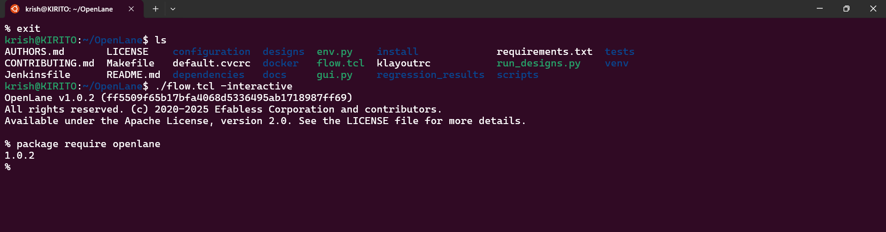
4.  Preparing the Design in OpenLane

In OpenLane, the "prep" step is crucial for setting up the file structure and merging essential technology and cell information.

-   **File Structure Setup**: Create a structured directory in your project's design folder.
    
-   **Configurations**: The "config.tcl" file generated in this folder contains critical parameters used by OpenLane for your specific run. These configurations tailor the OpenLane flow to your design.
    
-   **Merging Technology and Cell Data**: The command merges essential technology LEF data, which includes layer definitions and design rules needed for Place-and-Route (PnR). Additionally, it combines cell LEF data, reducing Design Rule Check (DRC) errors during the PnR process.
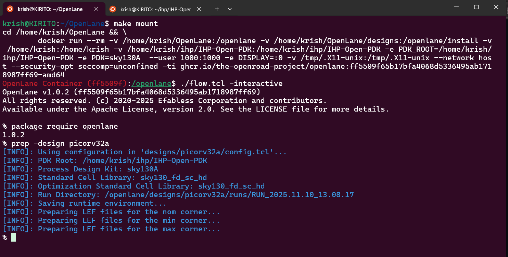
Prepare design command :

```
prep -design <design_name> -tag <tag>

```

After running the `prep` command, you'll find a well-structured project directory with all the necessary information and configurations, ready for the OpenLane flow.
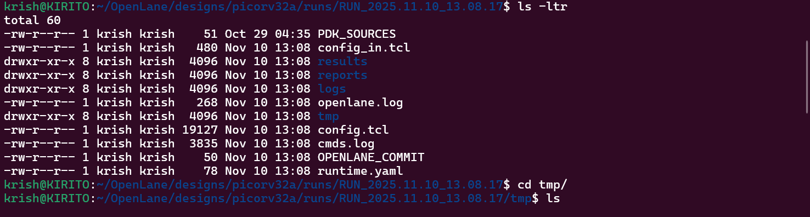
## Synthesis 
run synthesis using this command 
```
run_synthesis
```
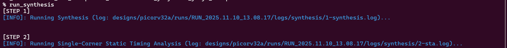
the result of synthesis is

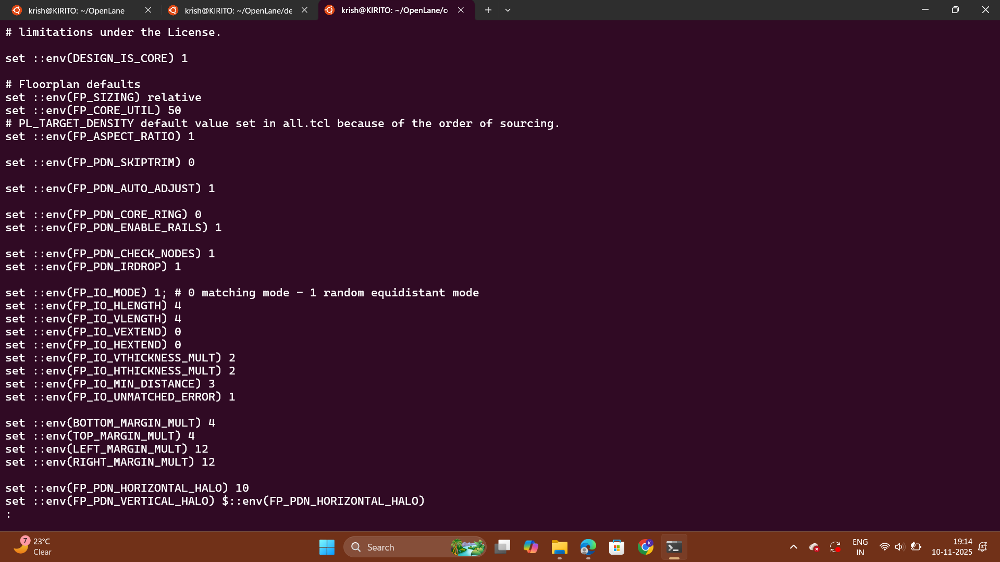
## Day 2: Floorplanning
Floorplanning is a critical phase in chip design that establishes the initial chip layout and organization, ensuring efficient use of resources and meeting design goals. In the Floorplanning phase, the following key actions are typically performed:

1.  **Die Area**: Define the total area of the chip's semiconductor material.
    
2.  **Core Area**: Specify the area within the die that contains the primary logic and functional components.
    
3.  **Core Utilization**: Determine the utilization factor, representing the ratio of the area occupied by the netlist to the core area (usually 50%-70%).
    
4.  **Aspect Ratio**: Establish the aspect ratio, which is the ratio of height to width (1 for square, other values for rectangles).
    
5.  **Place Macros**: Arrange pre-designed macros such as memories, clock gating cells, comparators, muxes, etc., within the core area.
    
6.  **Power Distribution Network**: Set up the power distribution network, which may include power straps and taps (although this is sometimes done later in tools like OpenLANE).
    
7.  **Place Input and Output Pins**: Determine the locations for input and output pins, optimizing for signal integrity, power consumption, and timing considerations.
### Key Aspects of Floorplanning in Chip Design

### 1\. Utilization Factor and Aspect Ratio


-   **Utilization Factor**: This represents the amount of die core area occupied by standard cells. It's typically maintained within the range of 50%-70% (utilization factor of 0.5-0.7). This range ensures optimal placement and feasible routing within the chip, promoting efficient use of resources.
    
-   **Aspect Ratio**: The aspect ratio defines the shape of the chip and is calculated by dividing the height of the core area by its width. An aspect ratio of 1 indicates a square chip. Aspect ratio choices influence the chip's physical dimensions and layout.
    

### 2\. Preplaced Cells (MACROs)


-   Preplaced cells, often referred to as MACROs, play a crucial role in enabling hierarchical chip design. They allow VLSI engineers to modularize larger designs. In floorplanning, preplaced cells are assigned specific locations within the core area. Blockages are also defined to ensure that standard cells are not placed in the preplaced cell regions.

### 3\. Decoupling Capacitors


-   Decoupling capacitors are strategically placed near preplaced cells during Floorplanning. They address voltage drops caused by interconnecting wires, which can disrupt noise margins or induce an indeterminate state in circuits. These capacitors charge up to the power supply voltage over time and act as reservoirs of charge. When the circuit requires a transition, they supply the needed charge, effectively decoupling the circuit from the main power supply and stabilizing operation.

### 4\. Power Planning


-   Power planning is a vital aspect of Floorplanning aimed at reducing noise in digital circuits due to voltage droop and ground bounce. Coupling capacitance forms between interconnect wires and the substrate. During transitions on a net, the charge associated with coupling capacitors may be dumped to the ground. Sufficient ground taps and a robust power distribution network (PDN) with multiple power strap taps are essential to lower resistance, maintain ground voltage stability, and enhance noise margins.

### 5\. Pin Placement


-   Pin placement optimization is crucial for minimizing buffering, improving power efficiency, and managing timing delays. It involves determining the specific locations along the I/O ring where pins should be placed, guided by the connectivity information of the HDL netlist. Well-optimized pin placement can reduce buffering requirements and subsequently lower power consumption. Blockages are often introduced to distinguish between the core and I/O areas, ensuring proper isolation.


### FloorPlan using OPENLANE
we initiate the Floorplan in OpenLane using the command
```
run_floorplan
```
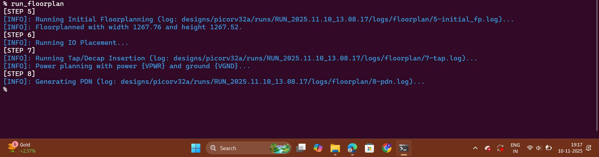
To view our floorplan in Magic we need to provide three files as input:

1.  Magic technology file (sky130A.tech)
2.  Def file of floorplan
3.  Merged LEF file

head over to the following directory to view the results of floorplan using Magic :

```
cd /Desktop/work/tools/openlane_working_dir/openlane/designs/picorv32a/runs/run_1/results/floorplan
```

To invoke magic use the command :

```
magic -T /home/vsduser/Desktop/work/tools/openlane_working_dir/pdks/sky130A/libs.tech/magic/sky130A.tech lef read ../../tmp/merged.lef def read picorv32a.floorplan.def &
```

Magic has the following GUI interface and a console window to execute commands

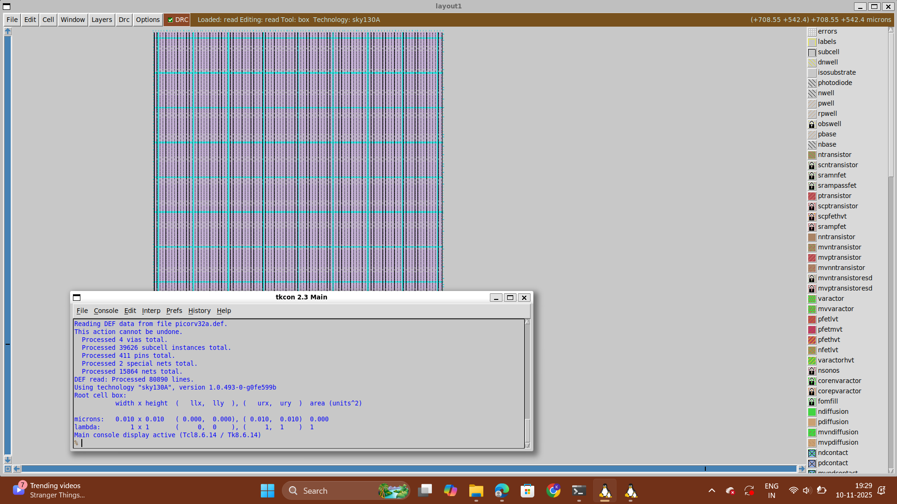
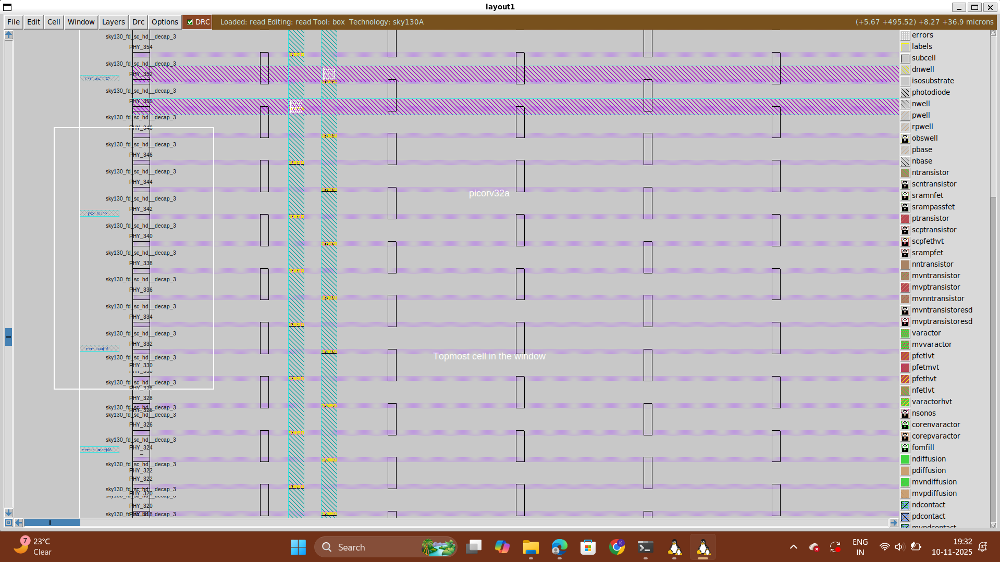
# Placement in Chip Design
### 1\. Netlist Binding


Netlist binding is the process of mapping the logical representation of a digital design onto standard cell shapes from a library. Each component in the netlist is mapped to a specific shape defined in the library.

### 2\. Initial Placement Design


In this phase, components from the netlist are placed within the chip's core area. Key considerations include:

1.  **Proximity to Pins**: Components are strategically placed based on their distance from input and output pins to minimize signal delays.
    
2.  **Signal Optimization**: Signals requiring rapid propagation, such as FF1 to FF2, are placed close together. Buffer cells may be added for signal integrity.
    
3.  **Wire-Length and Capacitance Estimation**: Wire length and capacitance estimates guide placement optimization, factoring in signal delay, power consumption, and integrity.
    

### 3\. Final Placement Optimization


The final placement phase fine-tunes the component layout within the chip, optimizing for performance. It assumes an ideal clock and aims to minimize signal delays, conserve power, and meet design constraints.

The next step in the Digital ASIC design flow after floorplanning is placement. The synthesized netlist has been mapped to standard cells and the floorplanning phase has determined the standard cells rows, enabling placement. OpenLane does placement in two stages:

1.  **Global Placement** \- Optimized but not legal placement. Optimization works to reduce wirelength by reducing half parameter wirelength
2.  **Detailed Placement** \- Legalizes placement of cells into standard cell rows while adhering to global placement

To do a placement in OpenLane:

```
run_placement
```

For placement to converge the overflow value needs to be converging to 0. At the end of placement cell legalization will be reported:

### Viewing Placement in Magic

To view placement in Magic the command mirrors viewing floorplanning, go to the results/floorplan directory and use the command:

```
magic -T /home/vsduser/Desktop/work/tools/openlane_working_dir/pdks/sky130A/libs.tech/magic/sky130A.tech lef read ../../tmp/merged.lef def read picorv32a.placement.def &
```
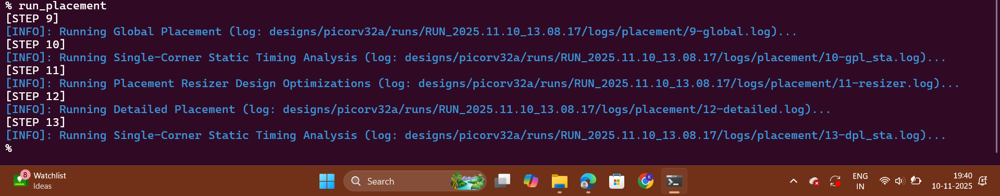
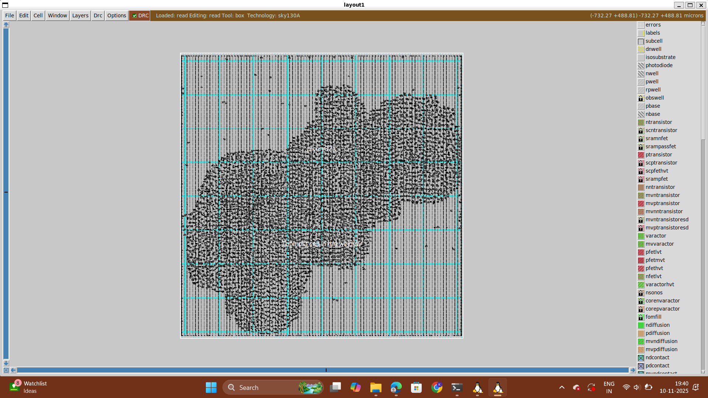

# Introduction to Magic Tool Options and DRC Rules
Download the files required for this lab from:

```
https://opencircuitdesign.com/open_pdks/archive/drc_tests.tgz
```
Every design rule has a code that can be used to refer to the documentation.
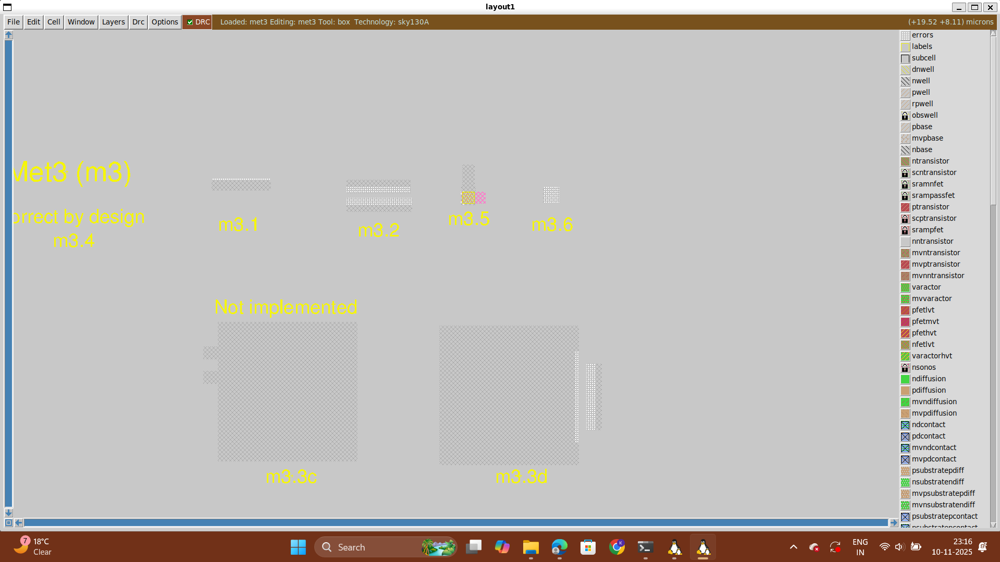
Select a particular layer (hover over the layer and click S) and type drc why to know what the DRC violation is.

To add contact cuts, add met3 contact by selecting an area and clicking on m3contact using the middle mouse button. Then type cif see VIA2 in Tkcon prompt.
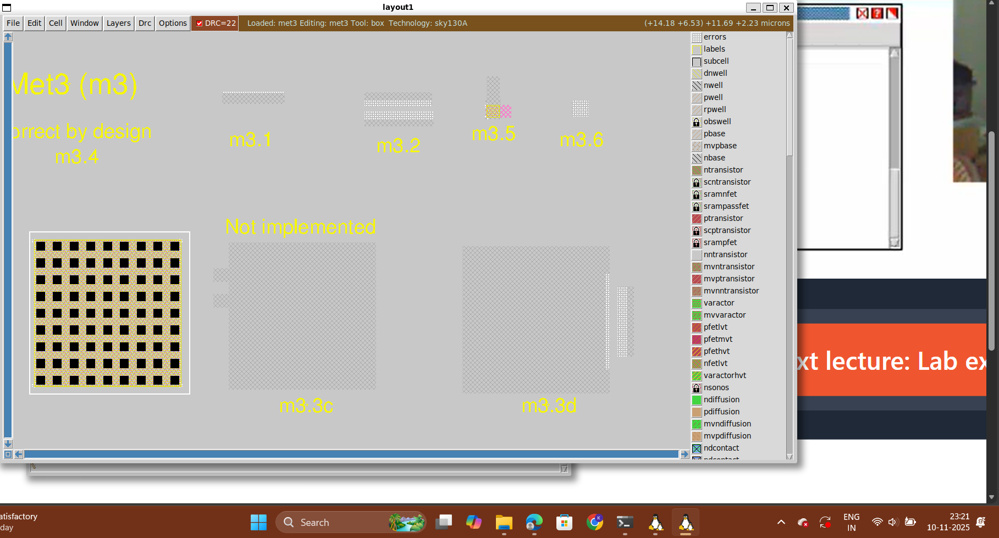
Magic techfile is under development and there may be some DRC violations that might not get reflected such violations are marked under incomplete DRC rules. Let's look at an example of a DRC violation and try correcting the rule file to capture the DRC error. Here is a violation

# Layout Designing using Magic
