# Inception of open-source EDA,OPENLANE and sky130 PDK
## Overview from Application to Hardware
-   **Apps**: Application software, often referred to as "apps," performs specific tasks or functions for end-users.
    
-   **System Software**: This category acts as an intermediary between hardware components and user-facing applications. It provides essential services, manages resources, and enables application execution.
    
-   **Operating System**: The fundamental software managing hardware resources and offering services for users and applications. It controls memory, processes, files, and interfaces (e.g., Windows, macOS, Linux, Android).
    
-   **Compiler**: Translates high-level programming code( C ,C++ , java etc... ) into assembly-level language.
    
-   **Assembler**: Converts assembly language code into machine code ( 10101011100 ) for direct processor execution.
    
-   **RTL (Register Transfer Level)**: Represents digital circuit behavior using registers and data transfer operations.
    
-   **Hardware**: Physical components of a computer system or electronic device enabling various tasks.
## Why do we need a Chip?
Consider the Arduino Uno, a versatile development board used for various projects. At its core lies the ATmega328P microcontroller, a crucial component.

Here's why we need this chip: The Arduino Uno is powered by the ATmega328P microcontroller. This chip serves as the brain of the board and is responsible for executing user-programmed code. It contains program memory (Flash), RAM, EEPROM, and various hardware peripherals. The microcontroller handles input, output, and data processing, making it the central processing unit (CPU) of the Arduino Uno. It operates at a clock speed of 16 MHz, ensuring precise timing for program execution.
## Components of a Chip:
A chip comprises several key components:
-   **Macros**: Predefined, reusable digital circuit blocks, like standard cells, simplifying complex chip design.
    
-   **Foundry IPs (Intellectual Property)**: Pre-designed, verified circuit elements (e.g., analog blocks, memory cores) licensed from semiconductor foundries for custom chip integration.
    
-   **IO Pads and Pins**: IO pads are physical interfaces connecting the chip to the external world. IO pins facilitate electrical connections between these pads and the internal circuitry for input and output communication.
## Overview of RTL to GDS Flow:
The RTL to GDS (Register-Transfer Level to Graphic Data System) flow is a complex process that transforms a high-level chip design into a physical layout ready for manufacturing. Here are the key steps involved:

1.  RTL Design

-   Creation of a high-level chip functionality description using HDL (Hardware Description Language) like VHDL or Verilog.
-   Captures the behavior and logic of the design.

1.  Functional Verification

-   Subject the RTL design to functional verification to ensure it adheres to specifications.
-   Use simulation and test benches to validate functionality and performance.

1.  RTL Synthesis

-   Transform RTL code into a gate-level representation using a synthesis tool.
-   Maps RTL onto a library of standard cells, optimizing for area, power, and timing.

1.  Technology Mapping

-   Map the synthesized gate-level netlist to the target technology library.
-   Replace generic gates with technology-specific counterparts (e.g., NAND, NOR, XOR).

1.  Physical Design

-   Transform the gate-level netlist into a manufacturable physical layout.

-   a. **Floorplanning**: Determine the chip's area and organize the placement of major components.
-   b. **Placement**: Assign specific gate and flip-flop locations, optimizing for metrics like wire length and performance.
-   c. **Clock Tree Synthesis (CTS)**: Create a clock distribution network to ensure uniform clock signals with minimal skew.
-   d. **Routing**: Establish physical interconnections using metal and polysilicon layers. Includes global and detailed routing.
-   e. **Physical Verification**: Check layout against design rules, including timing, power, signal, and rule violations.

1.  GDS Generation

-   Generate the GDS (Graphic Data System) file.
-   This binary file format represents the complete chip layout, including geometric details and interconnections.

1.  Signoff

-   Encompasses verification and validation steps.

The RTL to GDS flow is a critical process in chip design, ensuring the translation of high-level design into a manufacturable physical layout.
### Key Components Needed for ASIC Development
To develop an ASIC efficiently, you need three key components:

1.  **RTL IPs**: Source from platforms like GitHub, OpenCores, and LibreCores for pre-designed RTL blocks.
    
2.  **PDK Data**: Process Design Kit (PDK) data is needed to get the Design Fabricated.
    
3.  **EDA Tools**: Use Electronic Design Automation (EDA) tools for RTL synthesis, layout design, and verification.
# DAY 1: OpenLane and SKYWATER-130
The Skywater PDK files we are working with are described under `pdks`

1.  **SKYWATER-PDK**: This directory contains essential PDK files provided by the foundry, serving as the foundation for ASIC development.
    
2.  **Open\_pdks**: In this directory, you'll find scripts that bridge closed-source and open-source PDKs, ensuring compatibility with various Electronic Design Automation (EDA) tools. These scripts facilitate seamless integration.
    
3.  **Sky130A**: Specifically tailored for Skywater, this directory houses open-source-compatible PDK files. They are designed to work harmoniously with open-source EDA tools, empowering users to develop ASICs without reliance on proprietary software.

## Hands-on OpenLane Flow :
1.  Navigate to the OpenLane directory in your terminal.
    
2.  Type the following command: OpenLane provides the flexibility to run the entire flow in one go or to use an interactive mode for a more detailed step-by-step process
```
make mount
./flow.tcl -interactive
```
3.  Software Dependencies for OpenLane

To ensure that OpenLane functions correctly, you need to manage software dependencies. You can import these dependencies into the OpenLane tool by using the following command:
```
package require openlane
```

4.  Preparing the Design in OpenLane

In OpenLane, the "prep" step is crucial for setting up the file structure and merging essential technology and cell information.

-   **File Structure Setup**: Create a structured directory in your project's design folder.
    
-   **Configurations**: The "config.tcl" file generated in this folder contains critical parameters used by OpenLane for your specific run. These configurations tailor the OpenLane flow to your design.
    
-   **Merging Technology and Cell Data**: The command merges essential technology LEF data, which includes layer definitions and design rules needed for Place-and-Route (PnR). Additionally, it combines cell LEF data, reducing Design Rule Check (DRC) errors during the PnR process.

Prepare design command :

```
prep -design <design_name> -tag <tag>

```

After running the `prep` command, you'll find a well-structured project directory with all the necessary information and configurations, ready for the OpenLane flow.

## Synthesis 
run synthesis using this command 
```
run_synthesis
```

the result of synthesis is


## Day 2: Floorplanning
Floorplanning is a critical phase in chip design that establishes the initial chip layout and organization, ensuring efficient use of resources and meeting design goals. In the Floorplanning phase, the following key actions are typically performed:

1.  **Die Area**: Define the total area of the chip's semiconductor material.
    
2.  **Core Area**: Specify the area within the die that contains the primary logic and functional components.
    
3.  **Core Utilization**: Determine the utilization factor, representing the ratio of the area occupied by the netlist to the core area (usually 50%-70%).
    
4.  **Aspect Ratio**: Establish the aspect ratio, which is the ratio of height to width (1 for square, other values for rectangles).
    
5.  **Place Macros**: Arrange pre-designed macros such as memories, clock gating cells, comparators, muxes, etc., within the core area.
    
6.  **Power Distribution Network**: Set up the power distribution network, which may include power straps and taps (although this is sometimes done later in tools like OpenLANE).
    
7.  **Place Input and Output Pins**: Determine the locations for input and output pins, optimizing for signal integrity, power consumption, and timing considerations.
### Key Aspects of Floorplanning in Chip Design

### 1\. Utilization Factor and Aspect Ratio


-   **Utilization Factor**: This represents the amount of die core area occupied by standard cells. It's typically maintained within the range of 50%-70% (utilization factor of 0.5-0.7). This range ensures optimal placement and feasible routing within the chip, promoting efficient use of resources.
    
-   **Aspect Ratio**: The aspect ratio defines the shape of the chip and is calculated by dividing the height of the core area by its width. An aspect ratio of 1 indicates a square chip. Aspect ratio choices influence the chip's physical dimensions and layout.
    

### 2\. Preplaced Cells (MACROs)


-   Preplaced cells, often referred to as MACROs, play a crucial role in enabling hierarchical chip design. They allow VLSI engineers to modularize larger designs. In floorplanning, preplaced cells are assigned specific locations within the core area. Blockages are also defined to ensure that standard cells are not placed in the preplaced cell regions.

### 3\. Decoupling Capacitors


-   Decoupling capacitors are strategically placed near preplaced cells during Floorplanning. They address voltage drops caused by interconnecting wires, which can disrupt noise margins or induce an indeterminate state in circuits. These capacitors charge up to the power supply voltage over time and act as reservoirs of charge. When the circuit requires a transition, they supply the needed charge, effectively decoupling the circuit from the main power supply and stabilizing operation.

### 4\. Power Planning


-   Power planning is a vital aspect of Floorplanning aimed at reducing noise in digital circuits due to voltage droop and ground bounce. Coupling capacitance forms between interconnect wires and the substrate. During transitions on a net, the charge associated with coupling capacitors may be dumped to the ground. Sufficient ground taps and a robust power distribution network (PDN) with multiple power strap taps are essential to lower resistance, maintain ground voltage stability, and enhance noise margins.

### 5\. Pin Placement


-   Pin placement optimization is crucial for minimizing buffering, improving power efficiency, and managing timing delays. It involves determining the specific locations along the I/O ring where pins should be placed, guided by the connectivity information of the HDL netlist. Well-optimized pin placement can reduce buffering requirements and subsequently lower power consumption. Blockages are often introduced to distinguish between the core and I/O areas, ensuring proper isolation.


### FloorPlan using OPENLANE
we initiate the Floorplan in OpenLane using the command
```
run_floorplan
```

To view our floorplan in Magic we need to provide three files as input:

1.  Magic technology file (sky130A.tech)
2.  Def file of floorplan
3.  Merged LEF file

head over to the following directory to view the results of floorplan using Magic :

```
cd /Desktop/work/tools/openlane_working_dir/openlane/designs/picorv32a/runs/run_1/results/floorplan
```

To invoke magic use the command :

```
magic -T /home/vsduser/Desktop/work/tools/openlane_working_dir/pdks/sky130A/libs.tech/magic/sky130A.tech lef read ../../tmp/merged.lef def read picorv32a.floorplan.def &
```

Magic has the following GUI interface and a console window to execute commands


# Placement in Chip Design
### 1\. Netlist Binding


Netlist binding is the process of mapping the logical representation of a digital design onto standard cell shapes from a library. Each component in the netlist is mapped to a specific shape defined in the library.

### 2\. Initial Placement Design


In this phase, components from the netlist are placed within the chip's core area. Key considerations include:

1.  **Proximity to Pins**: Components are strategically placed based on their distance from input and output pins to minimize signal delays.
    
2.  **Signal Optimization**: Signals requiring rapid propagation, such as FF1 to FF2, are placed close together. Buffer cells may be added for signal integrity.
    
3.  **Wire-Length and Capacitance Estimation**: Wire length and capacitance estimates guide placement optimization, factoring in signal delay, power consumption, and integrity.
    

### 3\. Final Placement Optimization


The final placement phase fine-tunes the component layout within the chip, optimizing for performance. It assumes an ideal clock and aims to minimize signal delays, conserve power, and meet design constraints.

The next step in the Digital ASIC design flow after floorplanning is placement. The synthesized netlist has been mapped to standard cells and the floorplanning phase has determined the standard cells rows, enabling placement. OpenLane does placement in two stages:

1.  **Global Placement** \- Optimized but not legal placement. Optimization works to reduce wirelength by reducing half parameter wirelength
2.  **Detailed Placement** \- Legalizes placement of cells into standard cell rows while adhering to global placement

To do a placement in OpenLane:

```
run_placement
```

For placement to converge the overflow value needs to be converging to 0. At the end of placement cell legalization will be reported:

### Viewing Placement in Magic

To view placement in Magic the command mirrors viewing floorplanning, go to the results/floorplan directory and use the command:

```
magic -T /home/vsduser/Desktop/work/tools/openlane_working_dir/pdks/sky130A/libs.tech/magic/sky130A.tech lef read ../../tmp/merged.lef def read picorv32a.placement.def &
```


# Introduction to Magic Tool Options and DRC Rules
Download the files required for this lab from:

```
https://opencircuitdesign.com/open_pdks/archive/drc_tests.tgz
```
Every design rule has a code that can be used to refer to the documentation.

Select a particular layer (hover over the layer and click S) and type drc why to know what the DRC violation is.

To add contact cuts, add met3 contact by selecting an area and clicking on m3contact using the middle mouse button. Then type cif see VIA2 in Tkcon prompt.

Magic techfile is under development and there may be some DRC violations that might not get reflected such violations are marked under incomplete DRC rules. Let's look at an example of a DRC violation and try correcting the rule file to capture the DRC error. Here is a violation

# Layout Designing using Magic
Clone the following repository in the openlane directory to build all the dependencies:
```
git clone https://github.com/nickson-jose/vsdstdcelldesign.git
```
To invoke the layout of the inverter, use the following command:
```
magic -T sky130A.tech sky130\_inv.mag &
```

### DRC check in Magic happens in real time. 

Any DRC errors are immediately reflected in the DRC icon on the toolbar.
Extract Parasitics in Magic:
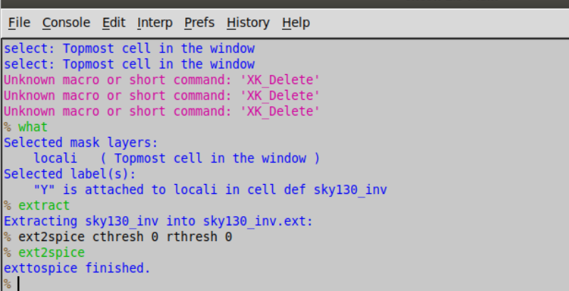
This creates a spice deck for simulation with all the parasitics.
 - The file has details of the inverter netlist, but the sources and their values are not specified. Modify the file as follows:

 - The grid size from the layout is 0.01u.
 - Specify the library for MOS.
 - Create VDD, VSS, Input pulse Va.
 - Specify the type of analysis to be done.
To run the spice netlist simulation, use the command on the terminal:
```
ngspice sky130\_inv.spice
```
Plot the transient analysis using:
```
plot y vs time a
```
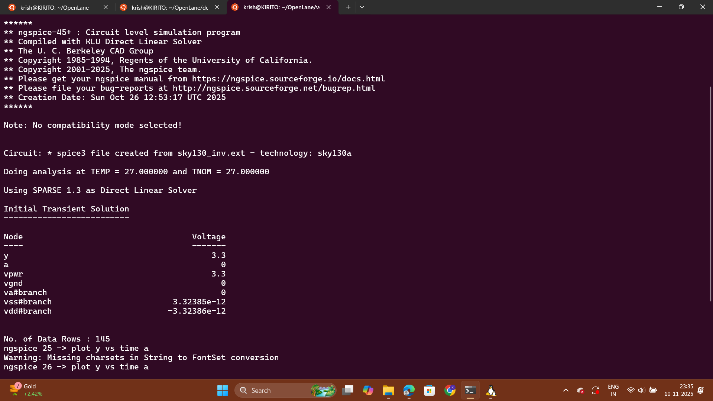
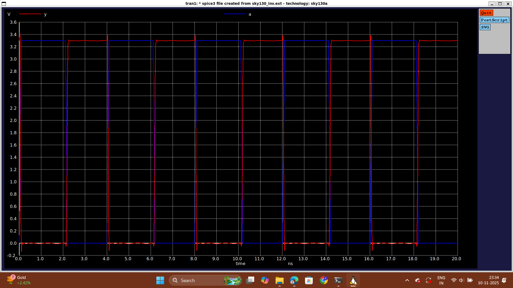

# LEF Extraction and Standard Cell Guidelines
During the place and route (PnR) process, an abstract view of the GDS files generated by Magic is used. This abstract view contains crucial information such as metal and pin details. This information is formally defined as LEF (Library Exchange Format) and is utilized by the PnR tool for interconnect routing, in conjunction with routing guides generated during the PnR flow.

There are two main types of LEF files that are essential for the PnR process:

1.  **Technology LEF**: This file contains information about layers, vias, and restricted Design Rule Check (DRC) rules. It specifies the characteristics of the fabrication process.
    
2.  **Cell LEF**: This file provides an abstract representation of standard cells used in the design. It includes pin information and other essential details.
    

### Guidelines for Creating Standard Cell Sets

[](https://github.com/VardhanSuroshi/VLSI-Physical-Design-Flow?tab=readme-ov-file#guidelines-for-creating-standard-cell-sets)

To ensure proper functionality and compatibility with the PnR tool, it's crucial to follow specific guidelines when creating standard cell sets:

1.  **Port Placement**: Input and output ports of standard cells must align with the intersection of vertical and horizontal tracks. This alignment ensures that signals can be routed efficiently.
    
2.  **Cell Dimensions**: Standard cell width should be an odd multiple of the track pitch, and the height should be an odd multiple of the vertical track pitch. This adherence to odd multiples helps in grid alignment.
    
3.  **Track Information**: Track information can be found in the `tracks.info` file, typically located at:
    
    ```
    ~/Desktop/work/tools/openlane_working_dir/pdks/sky130A/libs.tech/openlane/sky130fd_sc_hd/tracks.info
    ```
    
    In this file, the first value indicates the offset, and the second value indicates the pitch along the provided direction. This information is used to set the grid for standard cells.

    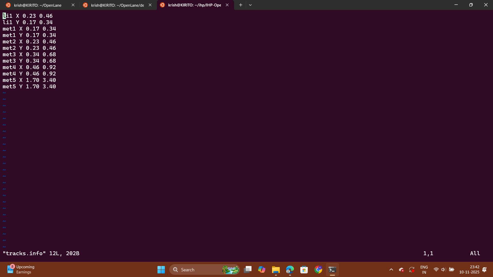

    By aligning with these guidelines, you can ensure that your standard cells are compatible with the PnR process. This compatibility allows for efficient routing and successful integration into the overall chip design.
        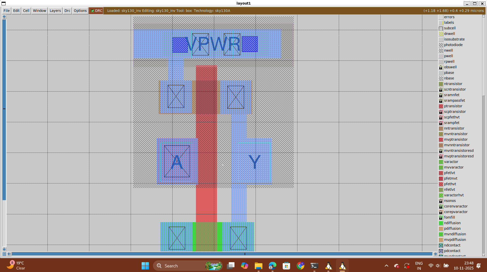
        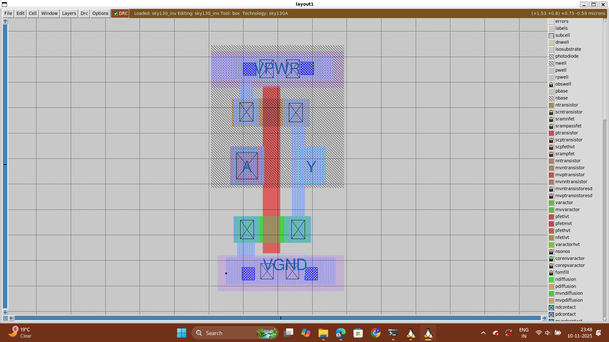

    By reviewing the layout, you can confirm that pins A and Y are appropriately placed at the intersection of X and Y tracks, meeting the first condition. Additionally, the PR boundary adheres to a width of 3 grids and a height of 9 grids, satisfying the second condition.

## LEF File Generation from Modified Layout

Once you have perfected your layout with the specified grid settings, you can proceed to generate the LEF (Library Exchange Format) file. Here are the steps to save your modified layout and extract the LEF file:

1.  **Save the Modified Layout**: In the console, type the following command to save the modified layout, which includes the new grid settings:
    
    ```
    save sky130_vsdinv.mag
    ```
    
    This command saves the modified layout in the current working directory.
    
2.  **Open the File and Extract LEF**: Next, you need to open the saved layout file and extract the LEF information. Use the following command to open the file with the specified technology file:
    
    ```
    magic -T sky130A.tech sky130_vsdinv.mag
    ```
    
    Once you have the layout open, access the console within Magic.

    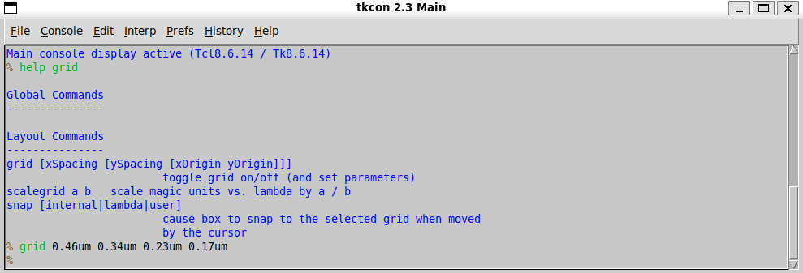
    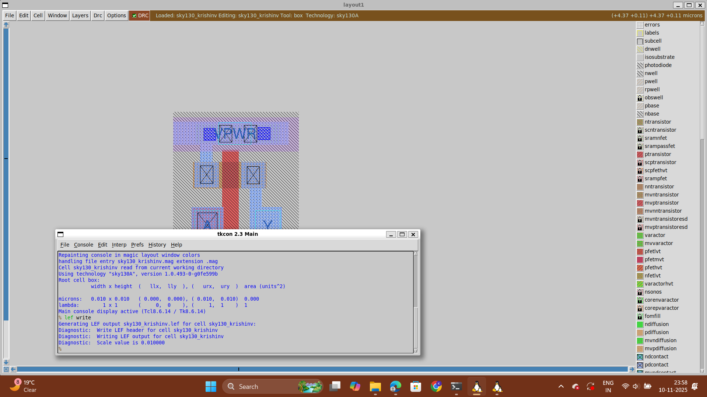
    1.  **Generate LEF**: Inside the console window, type the following command to generate the LEF file:
    
    ```
    lef write
    ```
    
    This command instructs Magic to write the layout information into an LEF file.

Following these steps will result in the creation of an LEF file that encapsulates the layout details of your design. This LEF file can then be used for various design and integration purposes in the overall chip design process.

## Including Custom Cells in OpenLane


To integrate custom cells into OpenLANE effectively, follow these initial configuration steps:

1.  **Characterize New Cell with GUNA:** Ensure your custom cell is fully characterized using GUNA for specified process corners.
    
2.  **Include Cell-Level Liberty File:** Add the cell-level Liberty (`.lib`) file of the custom cell to the top-level Liberty file. This provides timing and functional data to OpenLANE.
    
3.  **Reconfigure Synthesis Switches:** Modify the synthesis switches in `config.tcl` to make OpenLANE aware of the custom cell during synthesis and optimization.
4.  **Overwrite Previous Run:** When running OpenLANE for the project, overwrite any previous runs with the new configuration switches to include the custom cell.
5.  Check Synthesis Logs: Review synthesis logs to confirm the successful integration of the custom cell. Address any errors or warnings related to the cell's usage.
6.  Run floorplan and placement to see the new custom design cell being used in the placement stage. Use the following command to run placement
```
init_floorplan
run_placement
magic -T /home/vsduser/Desktop/work/tools/openlane_working_dir/pdks/sky130A/libs.tech/magic/sky130A.tech lef read ../../tmp/merged.lef def read picorv32a.placement.def &
```
 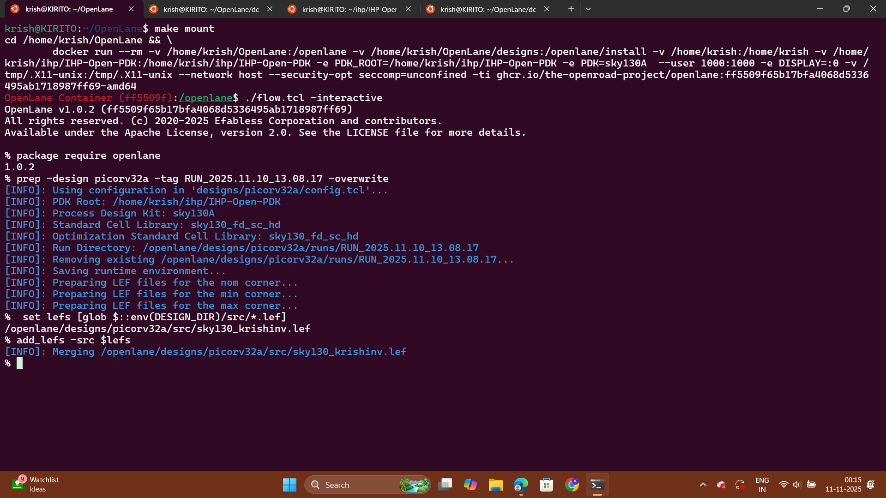
 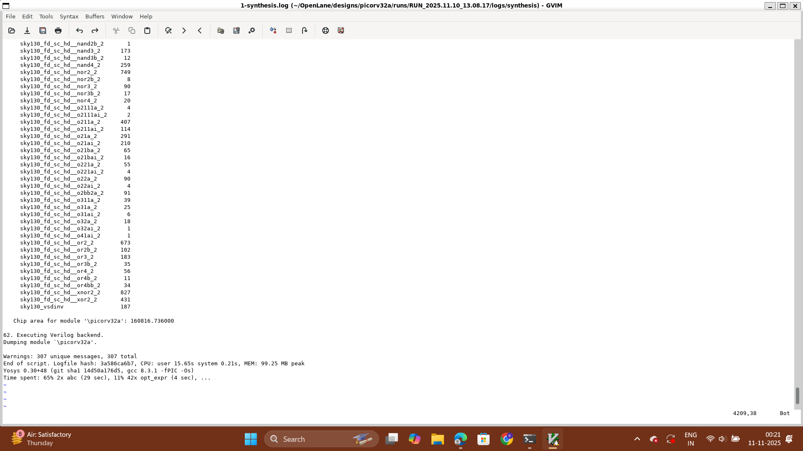
 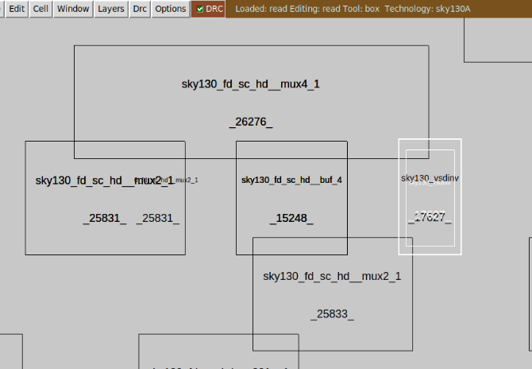
 # Optimizing Timing Constraints in VLSI Design

[](https://github.com/VardhanSuroshi/VLSI-Physical-Design-Flow?tab=readme-ov-file#optimizing-timing-constraints-in-vlsi-design)

Timing constraints are paramount in VLSI design, and minimizing slack violations is critical to ensure the reliable operation of circuits. Slack violations, typically detected during static timing analysis (STA), manifest as issues like worst negative slack (WNS) and total negative slack (TNS). Let's delve into strategies for effectively managing and reducing slack violations using tools like OpenLANE and OpenSTA:

## Understanding the Challenge

[](https://github.com/VardhanSuroshi/VLSI-Physical-Design-Flow?tab=readme-ov-file#understanding-the-challenge)

In VLSI design, timing constraints are pivotal to meet performance requirements. Slack violations, such as WNS and TNS, signify that certain paths in the circuit are not meeting their timing criteria. Addressing these issues is essential for ensuring correct circuit operation.

## Strategies for Slack Reduction

[](https://github.com/VardhanSuroshi/VLSI-Physical-Design-Flow?tab=readme-ov-file#strategies-for-slack-reduction)

To tackle slack violations, consider the following strategies:

### 1\. Synthesis Strategy Review

[](https://github.com/VardhanSuroshi/VLSI-Physical-Design-Flow?tab=readme-ov-file#1-synthesis-strategy-review)

Begin by examining your synthesis strategy in OpenLANE. Optimize it to enhance timing performance. Options like enabling `CELL_SIZING` and configuring `SYNTH_STRATEGY` with parameters like "DELAY 1" can be beneficial in alleviating slack issues.

### 2\. Fanout Load Adjustment

[](https://github.com/VardhanSuroshi/VLSI-Physical-Design-Flow?tab=readme-ov-file#2-fanout-load-adjustment)

High delay paths due to excessive fanout can be optimized by revisiting the synthesis process. Modify parameters such as `SYNTH_MAX_FANOUT` to fine-tune the fanout load. This can lead to significant reductions in slack violations.

### 3\. Cell Buffering

[](https://github.com/VardhanSuroshi/VLSI-Physical-Design-Flow?tab=readme-ov-file#3-cell-buffering)

Enhance signal drive strength by enabling cell buffering within your design. This approach boosts the performance of critical paths and reduces signal delays.

### 4\. Manual Cell Replacement

[](https://github.com/VardhanSuroshi/VLSI-Physical-Design-Flow?tab=readme-ov-file#4-manual-cell-replacement)

For in-depth slack reduction, consider manual cell replacement using the OpenSTA tool. Identify nets that are driving numerous outputs and replace the driver cells with larger versions of the same type. This manual optimization can yield substantial improvements in slack.

### 5\. Fanout Optimization

[](https://github.com/VardhanSuroshi/VLSI-Physical-Design-Flow?tab=readme-ov-file#5-fanout-optimization)

Leverage OpenLANE's built-in tools to optimize fanout values across your design. Adjusting fanout settings can help balance signal loads, mitigating delays, and improving overall timing performance.

# Clock Tree Synthesis (CTS) and Post-CTS STA Analysis

[](https://github.com/VardhanSuroshi/VLSI-Physical-Design-Flow?tab=readme-ov-file#clock-tree-synthesis-cts-and-post-cts-sta-analysis)

In the realm of VLSI design, the intricacies of clock tree synthesis (CTS) and the subsequent static timing analysis (STA) play pivotal roles in ensuring precise circuit performance. Let's delve into how OpenLANE manages these critical processes.

## Clock Tree Synthesis (CTS)

[](https://github.com/VardhanSuroshi/VLSI-Physical-Design-Flow?tab=readme-ov-file#clock-tree-synthesis-cts)

### Addressing Key Concerns

[](https://github.com/VardhanSuroshi/VLSI-Physical-Design-Flow?tab=readme-ov-file#addressing-key-concerns)

After running the floorplan and standard cell placement in OpenLANE, the next crucial step is to introduce the clock tree for sequential elements within the design. Two primary concerns when generating the clock tree are:

1.  **Clock Skew**: This refers to the difference in arrival times of the clock signal for sequential elements across the entire design.
    
2.  **Delta Delay**: It represents the skew introduced through capacitive coupling of the clock tree nets.
    

### Executing CTS in OpenLANE

[](https://github.com/VardhanSuroshi/VLSI-Physical-Design-Flow?tab=readme-ov-file#executing-cts-in-openlane)

To perform clock tree synthesis in OpenLANE, follow these steps:

**Note:** CTS will introduce buffers throughout the clock tree, which will modify our netlist.

## Viewing Post-CTS Netlist

[](https://github.com/VardhanSuroshi/VLSI-Physical-Design-Flow?tab=readme-ov-file#viewing-post-cts-netlist)

OpenLANE generates a new .def file containing information about your design after CTS is performed. To view this netlist, use the Magic tool:

## Post-CTS STA Analysis

[](https://github.com/VardhanSuroshi/VLSI-Physical-Design-Flow?tab=readme-ov-file#post-cts-sta-analysis)

OpenLANE integrates the OpenROAD application, which includes OpenSTA for timing analysis. You can perform STA analysis seamlessly from within OpenLANE by invoking OpenROAD. Here's how:

1.  In OpenROAD, timing analysis involves creating a .db database file. This file is generated using the post-CTS LEF and DEF files. To generate the .db files within OpenROAD:

**Note:** Whenever the DEF file changes, recreate the .db file.

1.  After .db generation, users can configure tools and then report propagated clock timing analysis.

## Enhancing the Process

[](https://github.com/VardhanSuroshi/VLSI-Physical-Design-Flow?tab=readme-ov-file#enhancing-the-process)

After addressing slack violations in the initial synthesis phase, OpenLANE generates a mapped.v file in the synthesis results. However, to maintain consistency with the resolved violations from the pre\_sta.conf file, you can write this netlist using `write_verilog` and replace the openlane-generated mapped file (e.g., picorv32a.synthesis.v).

Proceeding with the OpenLANE flow, continue with the following stages:

-   run\_floorplan
-   run\_placement
-   run\_cts

**Note:** The CTS step should have added buffers and modified the netlist.

## Fine-Tuning Post CTS-STA Analysis

[](https://github.com/VardhanSuroshi/VLSI-Physical-Design-Flow?tab=readme-ov-file#fine-tuning-post-cts-sta-analysis)

OpenLANE seamlessly integrates the OpenROAD application, which, in turn, includes OpenSTA for timing analysis. To perform STA analysis within OpenLANE, invoke OpenROAD and follow these steps:

1.  Create a .db database file within OpenROAD:
    
    -   Read the LEF file from the tmp folder of runs.
    -   Read the DEF file from the results of CTS.
    -   Write the .db file.
2.  Read the generated .db file.
    
3.  Read the CTS-generated Verilog file.
    
4.  Read the min and max liberty files.
    
5.  Set the clocks.
    
6.  Generate the necessary reports.
    

**Note:** The results may not meet the timing due to the usage of min and max liberty files, as OpenROAD does not support multi-corner optimization. Consider using only typical corner libraries.

# Day 5: Power Distribution Network, Routing, and SPEF Extraction

[](https://github.com/VardhanSuroshi/VLSI-Physical-Design-Flow?tab=readme-ov-file#day-5-power-distribution-network-routing-and-spef-extraction)

In the world of VLSI design, establishing an efficient Power Delivery Network (PDN) and optimizing routing are pivotal steps. OpenLANE provides solutions for managing these processes effectively.

## Power Distribution Network (PDN) Generation

[](https://github.com/VardhanSuroshi/VLSI-Physical-Design-Flow?tab=readme-ov-file#power-distribution-network-pdn-generation)

The PDN acts as a network of traces and components responsible for distributing power (VDD) effectively and reliably across the integrated circuit (IC). OpenLANE simplifies this process with the following components:

-   **Power Ring Global**: This is a continuous metal ring encircling the entire IC core, ensuring uniform distribution of power to the core logic and functional blocks. It minimizes voltage drops, guaranteeing power supply to all core regions.
    
-   **Power Halo Local**: The power halo forms a localized power distribution network around specific preplaced cells or macroblocks. Preplaced cells remain in fixed positions, and the power halo ensures they receive the necessary power connections.
    
-   **Power Straps**: These are metal traces or structures that transport power from the chip's periphery to central regions, reducing the distance power must travel. Power straps maintain consistent power distribution across the entire chip.
    
-   **Power Rails**: Metal lines run vertically or horizontally across the chip, supplying power to standard cells. Power rails ensure that each standard cell receives the required power for proper operation.
    

## Routing in Two Stages

[](https://github.com/VardhanSuroshi/VLSI-Physical-Design-Flow?tab=readme-ov-file#routing-in-two-stages)

Routing within OpenLANE is a two-stage process:

1.  **Global Routing**: During global routing, routing guides are generated for interconnects on the netlist. These guides define the layers to use and specify where each net will be located on the chip.
    
2.  **Detailed Routing**: In the detailed routing stage, metal traces are meticulously placed across the routing guides to physically implement the interconnects.
    

## Initiating Routing with OpenLANE

[](https://github.com/VardhanSuroshi/VLSI-Physical-Design-Flow?tab=readme-ov-file#initiating-routing-with-openlane)

To kickstart the routing process within OpenLANE, simply use the command `run_routing`.

## SPEF Extraction for Parasitic Information

[](https://github.com/VardhanSuroshi/VLSI-Physical-Design-Flow?tab=readme-ov-file#spef-extraction-for-parasitic-information)

In the semiconductor industry, the Standard Parasitic Exchange Format (SPEF) is a vital file format used to represent parasitic information such as resistance and capacitance. Accurate modeling and extraction of these parasitics are critical for optimizing electronic devices in VLSI design.

To perform SPEF extraction:

1.  Navigate to the SPEF Extractor directory using the following command:
    
    ```
    cd Desktop/work/tools/SPEF_Extractor
    ```
    
2.  Execute the SPEF extraction command, providing paths to the LEF and DEF files:
    
    ```
    python3 /home/vsduser/Desktop/work/tools/openlane_working_dir/openlane/designs/picorv32a/runs/18-09_06-26/tmp/merged.lef /home/vsduser/Desktop/work/tools/openlane_working_dir/openlane/designs/picorv32a/runs/18-09_06-26/results/routing/picorv32a.def
    ```
    

The resulting SPEF file can be found in the directory:

```
/home/vsduser/Desktop/work/tools/openlane_working_dir/openlane/designs/picorv32a/runs/18-09_06-26/results/routing/
```

By following these steps, you ensure precise modeling and extraction of parasitic elements, a crucial aspect of optimizing electronic devices in VLSI design.
